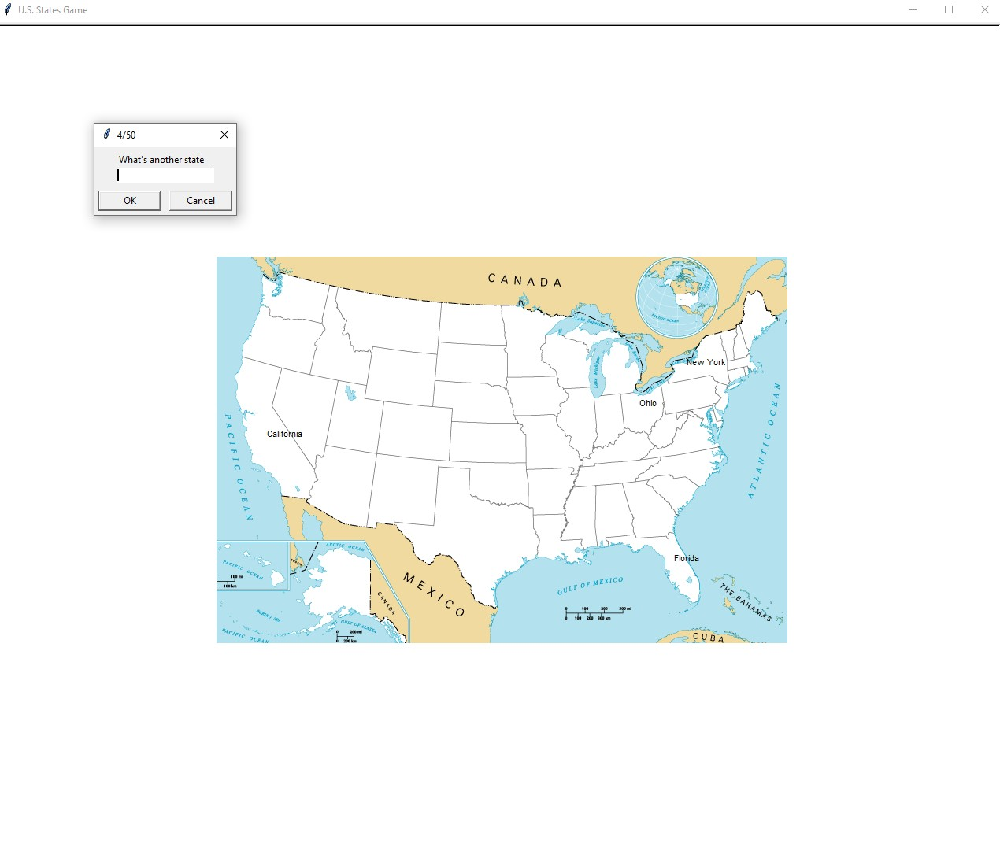

# Data analizes with Pandas with 2 projects
# 1. U.S. States Game 🗺️

## Overview
The **U.S. States Game** is an interactive Python project where users test their knowledge of U.S. states by identifying them on a map. The game uses the `turtle` module for displaying the map and `pandas` for handling state data.
---
## Preview

# 2. Squirrel Census Data Analysis

## Overview
This Python script analyzes data from the **2018 Central Park Squirrel Census** to count the number of squirrels with different fur colors and saves the results to a new CSV file. The program is a simple demonstration of using the `pandas` library for data manipulation and analysis.

---